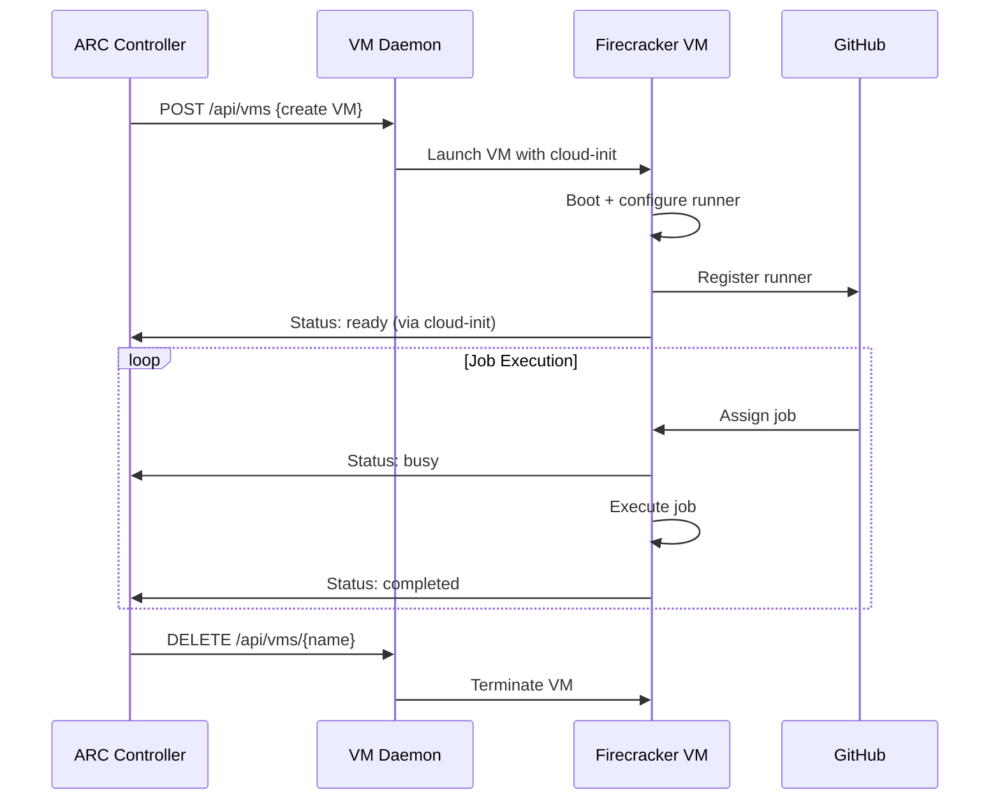

# ARC Firecracker Integration - Complete Guide

## Architecture Overview

The Firecracker integration for Actions Runner Controller (ARC) provides secure, isolated VM-based GitHub Actions runners using a host-based daemon architecture.

### Core Components

```
┌─────────────────────────────────────────────────────────────────┐
│ Kubernetes Cluster                                              │
│                                                                 │
│ ┌─────────────────┐    ┌─────────────────┐                     │
│ │ ARC Controller  │───▶│ Runner Resource │                     │
│ │ (Enhanced)      │    │ Firecracker     │                     │
│ └─────────────────┘    └─────────────────┘                     │
│          │                                                      │
│          ▼ HTTP API                                             │
│ ┌─────────────────────────────────────────────────────────────┐ │
│ │ Host VM Daemon (DaemonSet)                                  │ │
│ │ Port 8091 - VM Management API                              │ │
│ └─────────────────────────────────────────────────────────────┘ │
│          │                                                      │
│          ▼ Shell Commands                                       │
│ ┌─────────────────────────────────────────────────────────────┐ │
│ │ Firecracker Complete Script                                │ │
│ │ Kernel + Filesystem + VM Management                        │ │
│ └─────────────────────────────────────────────────────────────┘ │
│          │                                                      │
│          ▼ Firecracker API                                      │
│ ┌─────────────────┐    ┌─────────────────┐    ┌──────────────┐ │
│ │ Node 1          │    │ Node 2          │    │ Node N       │ │
│ │ ┌─────────────┐ │    │ ┌─────────────┐ │    │ ┌──────────┐ │ │
│ │ │VM1 VM2 VM3  │ │    │ │VM4 VM5      │ │    │ │VM N      │ │ │
│ │ │Runner Procs │ │    │ │Runner Procs │ │    │ │Runner Pr │ │ │
│ │ └─────────────┘ │    │ └─────────────┘ │    │ └──────────┘ │ │
│ └─────────────────┘    └─────────────────┘    └──────────────┘ │
└─────────────────────────────────────────────────────────────────┘
```

## Component Details

### 1. ARC Controller (Enhanced)

**Location**: `controllers/actions.summerwind.net/host_firecracker_vm_manager.go`

**Key Features**:
- **VM Manager Interface**: Abstracts VM operations (Create, Delete, GetStatus)
- **Host Manager**: Communicates with node daemons via HTTP API
- **Runner Name Consistency**: Uses runner names as VM identifiers throughout
- **Snapshot Support**: Passes snapshot names from annotations to VMs
- **Failover Support**: Multiple daemon URLs with automatic failover

**Key Methods**:
```go
type VMManager interface {
    CreateVM(ctx context.Context, runner *v1alpha1.Runner, registrationToken string) (*VMInfo, error)
    DeleteVM(ctx context.Context, runner *v1alpha1.Runner) error
    GetVMStatus(ctx context.Context, runner *v1alpha1.Runner) (*VMInfo, error)
}
```

**Environment Variables**:
- `ENABLE_FIRECRACKER=true` - Enables Firecracker mode
- `FIRECRACKER_DAEMON_URL=http://192.168.21.32:8091` - Daemon endpoint(s)

### 2. Host VM Daemon (Python)

**Location**: `host-install-improved.sh` (creates the daemon)

**Key Features**:
- **HTTP API Server**: Port 8091 for VM management
- **Dynamic Resource Management**: CPU oversubscription (4x), memory limits
- **Process Monitoring**: Tracks VM processes using hash-based VM IDs
- **Automatic Cleanup**: Removes dead VMs and releases resources
- **Health Monitoring**: Exposes system resources and VM status

**API Endpoints**:
```python
GET  /health                 # System health and resources
GET  /metrics               # Prometheus metrics
GET  /api/vms/{vm_name}     # VM status
POST /api/vms               # Create VM
DELETE /api/vms/{vm_name}   # Delete VM
```

**Resource Management**:
- **Memory**: Reserve 20% for OS, use 80% of available
- **CPU**: 4x oversubscription ratio
- **Cleanup**: Automatic dead VM detection and cleanup

### 3. Firecracker Complete Script

**Location**: `firecracker-complete.sh`

**Key Features**:
- **All-in-One**: Kernel building, filesystem creation, VM management
- **Ubuntu 24.04 Support**: Full GitHub Actions runner environment
- **Snapshot Management**: Create/restore VM snapshots for fast startup
- **Cloud-Init Integration**: Automated VM configuration
- **Network Modes**: Static IP and host bridge with DHCP
- **Status Reporting**: VMs report back to ARC controller

**Main Commands**:
```bash
./firecracker-complete.sh build-kernel     # Build custom kernel
./firecracker-complete.sh build-fs         # Build runner filesystem  
./firecracker-complete.sh snapshot prod-v1 # Create snapshot
./firecracker-complete.sh launch           # Launch VM
```

## Integration Flow

### VM Creation Process

1. **RunnerDeployment Creation**
   ```yaml
   apiVersion: actions.summerwind.dev/v1alpha1
   kind: RunnerDeployment
   metadata:
     annotations:
       runner.summerwind.dev/firecracker-snapshot: prod-v1
   ```

2. **ARC Controller Processing**
   - Detects Firecracker runtime annotation
   - Generates GitHub registration token
   - Calls VM daemon API

3. **VM Daemon Execution**
   ```python
   # Resource check
   can_create, message = self.resource_manager.can_create_vm(memory_mb, cpus)
   
   # Reserve resources
   self.resource_manager.reserve_resources(vm_name, memory_mb, cpus)
   
   # Execute shell command
   cmd = ["/opt/firecracker/firecracker-complete.sh", "launch", 
          "--name", vm_name, "--snapshot", snapshot]
   ```

4. **VM Startup**
   - Firecracker VM boots from snapshot
   - Cloud-init configures runner
   - Runner registers with GitHub
   - VM reports status to ARC

### Status Reporting Flow



## API Specifications

### ARC Controller → VM Daemon

**Create VM**:
```http
POST http://192.168.21.32:8091/api/vms
Content-Type: application/json

{
  "name": "tenki-standard-autos-123456789",
  "memory": 16384,
  "cpus": 4,
  "github_url": "https://github.com/aakash-test-workflow",
  "github_token": "BNNA...XA",
  "snapshot": "prod-v1"
}

Response 202:
{
  "vm_name": "tenki-standard-autos-123456789",
  "status": "creating",
  "message": "VM creation started",
  "assigned_node": "tenki-staging-runner-2"
}
```

**Get VM Status**:
```http
GET http://192.168.21.32:8091/api/vms/tenki-standard-autos-123456789

Response 200:
{
  "vm_name": "tenki-standard-autos-123456789",
  "vm_id": "37f32909",
  "status": "running",
  "memory_mb": 16384,
  "cpus": 4,
  "created_at": 1748865211.157186,
  "last_seen": 1748865375.2457354
}
```

### VM → ARC Controller (via Cloud-Init)

VMs report status changes using webhooks configured in cloud-init:
```bash
curl -X POST http://arc-controller:8080/api/v1/runners/${RUNNER_NAME}/status \
  -H "Content-Type: application/json" \
  -d '{"status": "ready", "vm_ip": "192.168.1.100"}'
```

## Configuration

### RunnerDeployment Annotations

```yaml
metadata:
  annotations:
    runner.summerwind.dev/firecracker-snapshot: "prod-v1"
    runner.summerwind.dev/firecracker-kernel: "/custom/kernel"
    runner.summerwind.dev/firecracker-ephemeral: "true"
    runner.summerwind.dev/firecracker-arc-mode: "true"
```

### ARC Controller Environment

```yaml
env:
- name: ENABLE_FIRECRACKER
  value: "true"
- name: FIRECRACKER_DAEMON_URL  
  value: "http://192.168.21.32:8091"
```

### VM Daemon Configuration

Dynamic resource limits calculated at startup:
```python
TOTAL_MEMORY_MB = psutil.virtual_memory().total // (1024 * 1024)
TOTAL_CPUS = psutil.cpu_count()
CPU_OVERSUBSCRIPTION_RATIO = 4
MEMORY_RESERVATION_PCT = 20
MAX_USABLE_MEMORY_MB = (TOTAL_MEMORY_MB * 80) // 100
MAX_VIRTUAL_CPUS = TOTAL_CPUS * 4
```

## Deployment Architecture

### Current Production Setup

**Kubernetes Environment**: 
- ARC Controller: `arc-systems` namespace
- VM Daemon: DaemonSet on nodes with `firecracker.io/enabled=true` label

**Host Nodes**:
- VM Daemon Host: `tenki-staging-runner-2` (192.168.21.32)
- Port: 8091 (VM Management API)
- Storage: `/opt/firecracker/firecracker-data/`

**Network Configuration**:
- Bridge: `br0` (host bridge networking)
- VMs: DHCP-assigned IPs from host network
- TAP devices: `tap-{vm_id}` per VM

### Deployment Files

1. **ConfigMaps**:
   - `firecracker-scripts`: Contains `firecracker-complete.sh`
   - `firecracker-host-install-v2`: Contains `host-install-improved.sh`

2. **DaemonSet**: `firecracker-vm-daemon`
   - Runs on labeled nodes
   - Mounts host directories and ConfigMaps
   - Installs and runs VM daemon

3. **ARC Controller**: Enhanced with Firecracker support
   - Image: `v3.0.6-fc-integration-fix-v2`
   - Environment: `ENABLE_FIRECRACKER=true`

## Networking

### Host Bridge Mode (Production)

**Setup**:
```bash
# Host bridge configuration (created by infrastructure)
ip link show br0  # Host bridge device

# Per-VM TAP devices (created dynamically)
ip tuntap add dev tap-37f32909 mode tap
ip link set dev tap-37f32909 master br0
ip link set dev tap-37f32909 up
```

**VM Network Config** (via cloud-init):
```yaml
network:
  version: 2
  ethernets:
    eth0:
      dhcp4: true
```

**Benefits**:
- VMs get IPs from host DHCP server
- Full network connectivity to host environment
- No NAT or port forwarding needed

## Security

### GitHub Token Security

**Host-Side Token Generation** (Secure):
```go
// ARC Controller generates short-lived registration tokens
registrationToken := generate_registration_token(github_url, github_pat, runner_name)
```

**VM receives only registration token**:
- ✅ Short-lived (hours)
- ✅ Single-use for runner registration
- ✅ Limited scope (runner registration only)
- ❌ Personal Access Token never passed to VM

### VM Isolation

- **Kernel-level isolation**: Complete VM boundaries
- **Resource limits**: Hard memory/CPU limits via Firecracker
- **Network isolation**: Separate network namespace per VM
- **Process isolation**: VMs cannot access host processes

## Performance Characteristics

### Resource Efficiency

**Per-VM Overhead**:
- Memory: ~100MB overhead per VM
- CPU: <5% overhead for virtualization
- Storage: Shared kernel/snapshot reduces footprint

**Scaling Characteristics**:
- **VM Startup**: 5-10 seconds from snapshot
- **Cold Start**: 30-60 seconds with filesystem build
- **Concurrent VMs**: Limited by host memory (typically 10-50 per node)

### Current Performance Metrics

**Host**: `tenki-staging-runner-2`
- **Total Memory**: 128GB
- **Max VM Memory**: ~100GB (with 20% reserved)
- **CPU Oversubscription**: 4x (supports 256 vCPUs on 64-core host)
- **Active VMs**: Currently running 2-5 concurrent VMs

## Snapshot Management

### Snapshot Creation

```bash
# Build complete environment
./firecracker-complete.sh build-kernel --config working-kernel-config
./firecracker-complete.sh build-fs

# Create production snapshot
./firecracker-complete.sh snapshot prod-v1
```

**Snapshot Contents**:
- Ubuntu 24.04 base system
- GitHub Actions runner (v2.324.0)
- Docker CE with buildkit
- Development tools (Node.js, Python, Java 8/11/17/21)
- Pre-configured networking and services

### Snapshot Usage

VMs boot from snapshots for fast startup:
```bash
# VM creation with snapshot
./firecracker-complete.sh launch --snapshot prod-v1 --name runner-123
```

**Benefits**:
- **Fast startup**: 5-10 seconds vs 30-60 seconds cold start
- **Consistency**: All runners start from identical state
- **Security**: Known good baseline configuration

## Troubleshooting

### Common Issues

#### 1. VM Creation Stuck in "Creating"

**Root Cause**: VM ID/name mismatch between ARC controller and daemon

**Fixed**: Use runner names consistently throughout (v3.0.6-fc-integration-fix-v2)

#### 2. Snapshot Parameter Empty

**Root Cause**: ARC controller not passing annotation values

**Fixed**: Use `fcConfig.SnapshotName` instead of hardcoded empty string

#### 3. Network Connectivity Issues

**Symptoms**: VMs created but can't reach GitHub

**Debug**:
```bash
# Check bridge configuration
ip link show br0

# Check TAP devices  
ip link show | grep tap-

# Test connectivity from VM
ssh -i instances/{vm_id}/ssh_key runner@{vm_ip} curl https://github.com
```

### Debug Commands

**Check VM Status**:
```bash
# Via daemon API
curl -s http://192.168.21.32:8091/api/vms/{vm_name} | jq

# Check running processes
ssh 192.168.21.32 "ps aux | grep firecracker"

# Check VM console logs
ssh 192.168.21.32 "tail -f /opt/firecracker/firecracker-data/instances/{vm_id}/firecracker-console.log"
```

**ARC Controller Logs**:
```bash
kubectl logs arc-gha-rs-controller-actions-runner-controller-{pod} -n arc-systems | grep -i firecracker
```

**VM Daemon Logs**:
```bash
ssh 192.168.21.32 "journalctl -u firecracker-agent -f"
```

## Status Resolution Summary

### Key Fixes Applied

1. **VM ID Consistency**: Changed from hash-based IDs to runner names throughout
2. **Snapshot Parameter**: Fixed empty snapshot issue in VM manager
3. **Status Reporting**: Enhanced VM status detection using process monitoring
4. **Resource Management**: Proper cleanup of dead VMs and resource tracking

### Current Status: ✅ Working

- ✅ **VM Creation**: VMs created successfully with correct parameters
- ✅ **Snapshot Support**: `prod-v1` snapshot used correctly
- ✅ **Network Connectivity**: Host bridge DHCP working
- ✅ **Runner Registration**: GitHub runners register and show as online
- ✅ **Status Reporting**: VMs properly report running status to ARC
- ✅ **Resource Management**: Dynamic limits with oversubscription working

### Next Steps

1. **Job Execution Testing**: Verify end-to-end workflow execution
2. **VM Lifecycle Management**: Implement automatic cleanup after jobs
3. **Scaling Testing**: Test with multiple concurrent VMs
4. **Monitoring**: Add comprehensive metrics and alerting 